# Analyzing AutosRUs dataset Statistically using R

## Ovierview

AutosRUS is a company who sells cars. 
We will be working with MechaCar dataset which is AutosRUs newest prototype. Management inform us that MechaCar
is suffering from production troubles and requires our help and the Data Analytics team  to use R to perform statistical tests required.

1. A Linear Regression to predict MPG
2. Summary Statistics on Suspension Coils
3. Perform T-tests on Suspension Coils
4. Design a case study comparing MechaCar to the competition

## Linear Regression to Predict MPG

The MechaCar dataset was imported, which has 50 rows and 6 columns.  
We will perform a multiple linear regression using MPG as the dependent variable and 
vehicle_length, vehicle_weight, spoiler_angle, ground_clearance and AWD as the independent variables.  

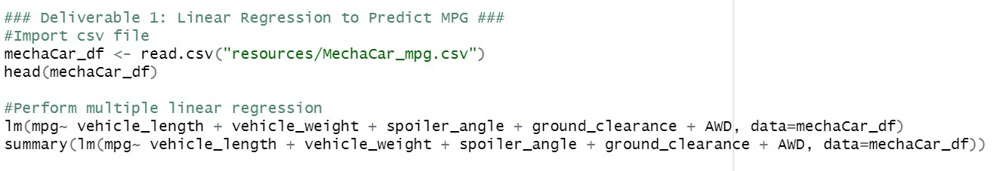

The results obtained from the code above:

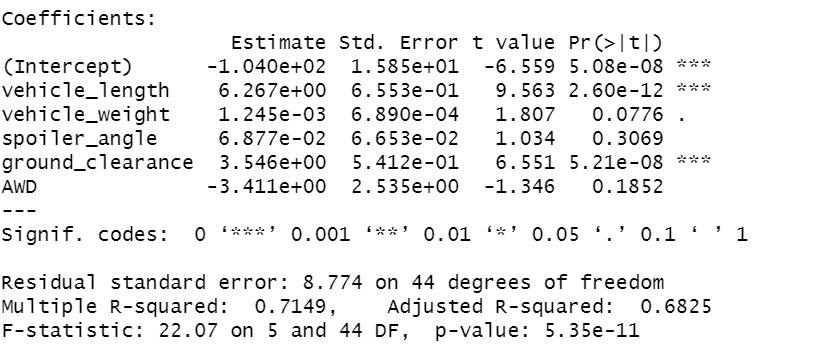

The equation obtained was:

__MPG = 6.267*vehicle_length + 1.245e-03*vehicle_weight + 6.877e-02*spoiler_angle + 3.546*ground_clearance - 3.411*AWD - 1.040e02__

Ho: The slope of the linear model is zero  
Ha: The slope of the linear model is different from zero

- The results from above shows that vehicle_length and ground_clearance provide significant non-random amounts of variance to the equation. Their p-values are less than the significance leve (0.05) and therefore the Ho has to be rejected, while for vehicle_weight, spoiler_angle and AWD their p-values are greater that the significance level and therefore, the Ho can't be rejected, in other words, they don't have an effect on the response variable.

- The slope of the linear model could not be considered zero because the p-value(3.35e-11) is less than our significance level(0.05) and therefore the Ho has to be rejected.

- The r-squared is 0.7149, in other words, approximately the model could predict correctly the 71% of the MPG data.

## Summary Statistics on Suspension Coils

The design specifications for the MechaCar suspension coils dictate that the variance of the suspension coils must not exceed 100 pounds per square inch. Does the current manufacturing data meet this design specification for all manufacturing lots in total and each lot individually?

To answer the previous question, the dataset was imported into R.  
It has 150 rows and 3 columns (Vehicule_ID, Manufacturing_Lot and PSI)

A total_summary dataframe was created to obtain the mean, median, variance and standard deviation from PSI.

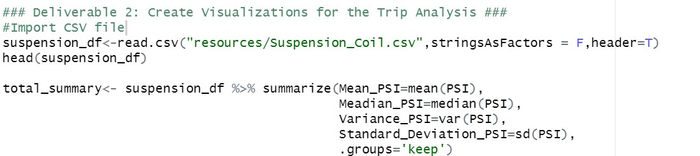

A lot_summary was obtained to analyize the same information for each manufacturing_lot.

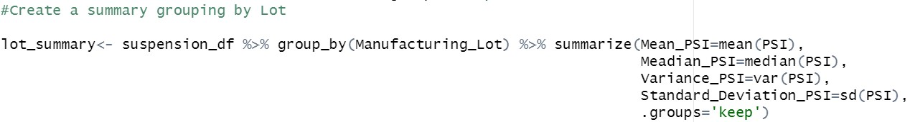

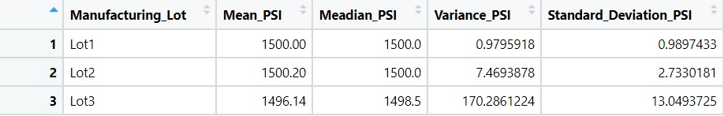

From the results we can see that the variance from the sample 62.29356 it's within the variance from the design specifications for the MechaCar that's 100.
Analyzing each manufacturing_lot, we can see that lot1 and lot2 do not exceed the 100 pounds per square inc variance, but the lot3 variance it's 170.28 which is higher than the 100. 
A boxplot was implemented to see the distribution of the data regarding each manufacturing lot.

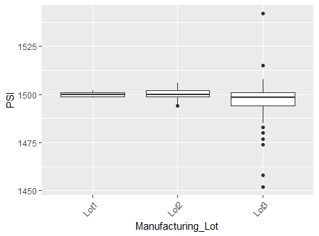

From the graph we can see that the 3 manufacturing_lots have similar means and that the lot3 has several outliers that could cause the increase in its variance.

### T-tests on Suspension Coils

We have to perform t-tests to determine if all manufacturing lots and each lot individually are statistically different from the population mean of 1,500 pounds per square inch.

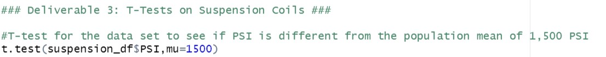

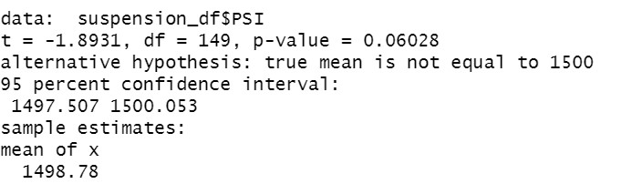

Then the t-test for each manufacturing lot was performed.

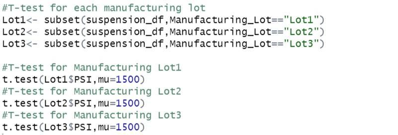

Manufacturing lot1
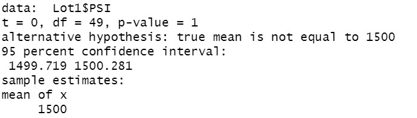

Manufacturing lot2
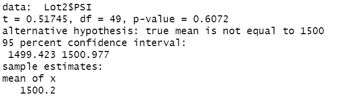

Manufacturing lot3
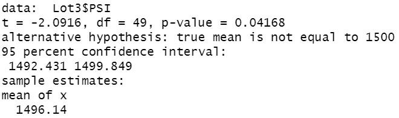

Stating 
Ho: The means is equal to 1500
Ha: The mean is different to 1500

From the results obtained we can determine that p-value from lot3 is less than 0.05 and therefore we have to reject Ho.  
The process from the lot 3 has to be reviewed and find out the reason of the results.

### Study Desing: MechaCar vs Competition

To compare the MechaCar performance against the competition we could take in account some important features.  
The metrics to gather information in order to design a new study are:

* 0-60 mph time
* Braking distance (60-0 mph)
* MPG city
* MPG highway
* Cost
* Safety
* Vehicle weight
* Vehicle length

The new variables were added because they have influence on the performance of the vehicles and also the purchase of the cars. With this we can have a better undestanding of how the cars and the market is behaving. 
We can perform a multiple linear regression to see if the model predicts the behaviour of the data.  
The hypothesis for the study are:

Ho: The performance of MechaCars against the competitors is the same.
Ha: The performance of MechaCars against the competitors is not the same.

Once the data is gathered and the method performed we can obtain the equation and p-values to understand what variables have influence or not in the model.

